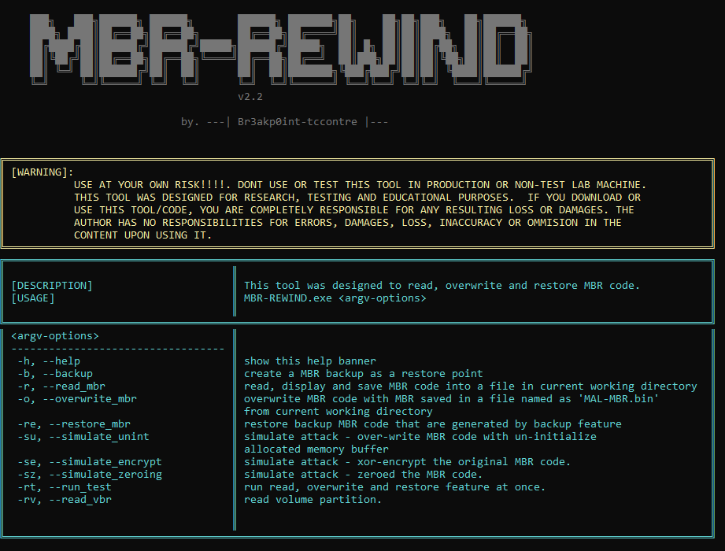

# MBR-REWIND (READ-WRITE-RESTORE MBR CODE POC Tool) 
--------------------------------------------------------

 </img>

 ## WARNING: 
 USE AT YOUR OWN RISK!!!!. DONT USE OR TEST THIS TOOL IN PRODUCTION OR NON-TEST LAB MACHINE
 THIS TOOL WAS DESIGNED FOR RESEARCH, TESTING AND EDUCATIONAL PURPOSES.  IF YOU DOWNLOAD OR
 USE THIS TOOL/CODE, YOU ARE COMPLETELY RESPONSIBLE FOR ANY RESULTING LOSS OR DAMAGES.
 THE AUTHOR HAS NO RESPONSIBILITIES FOR ERRORS, DAMAGES, LOSS, INACCURACY OR OMMISION IN
 THE CONTENT UPON USING IT.

## DESCRIPTION:
Analyzing destructive malware that overwrite, encrypt or wipe MBR code might be time consuming in terms of testing and generating events, 
because once the machine is rebooted, you need either to revert your test lab or restore the Original MBR code if you save it.
This POC tool is designed for that research, testing and detection purposes. The following features of this are stated below:

1. **backup** the current MBR code for restoration purposes
2. **Read** the current MBR code in Boot Sector or PhysicalDriveO 
3. **Overwrite** The MBR code with customized MBR code that was saved in 'mal_mbr.bin' file
4. **restore** the original MBR code
5. **simulate** known attack made by adversaries or threat actor (e.g whispergate, notpetya,olympic destroyer and etc.) to destroy and  MBR code

## FEATURES:
--------------------------------------------------------

### BACKUP-MBR: 
```
MBR-REWIND -b
```

Before you can execute all other feature, the tool requires you to generate MBR code back-up that will be save in 'backup_mbr_code.bin' for restoration purposes.


