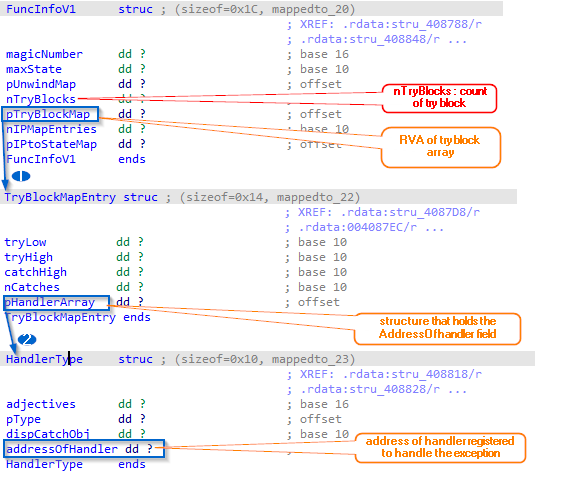

# Simple SEH tryBlockMap structure Helper

### Description
this simple script is a idapython for idapro 7.x to add comment to the IDB of all possible HandlerOfAddress found in each tryBlockMap entries in a FuncInfo structure of SEH frame.

the appraoch is locating __CxxFramehandler function and parse  each ehFuncInfo structure pass to it.

### How:
1. just load this idapython in loaded exe in idapro (make sure you are in code section).

### Information:

The FuncInfo structure can help our static analysis to locate all the possible AddressOfhandler that will be executed for each registered SEH. the structure show in figure below.

 </img>

