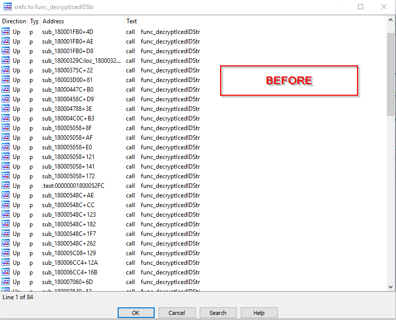
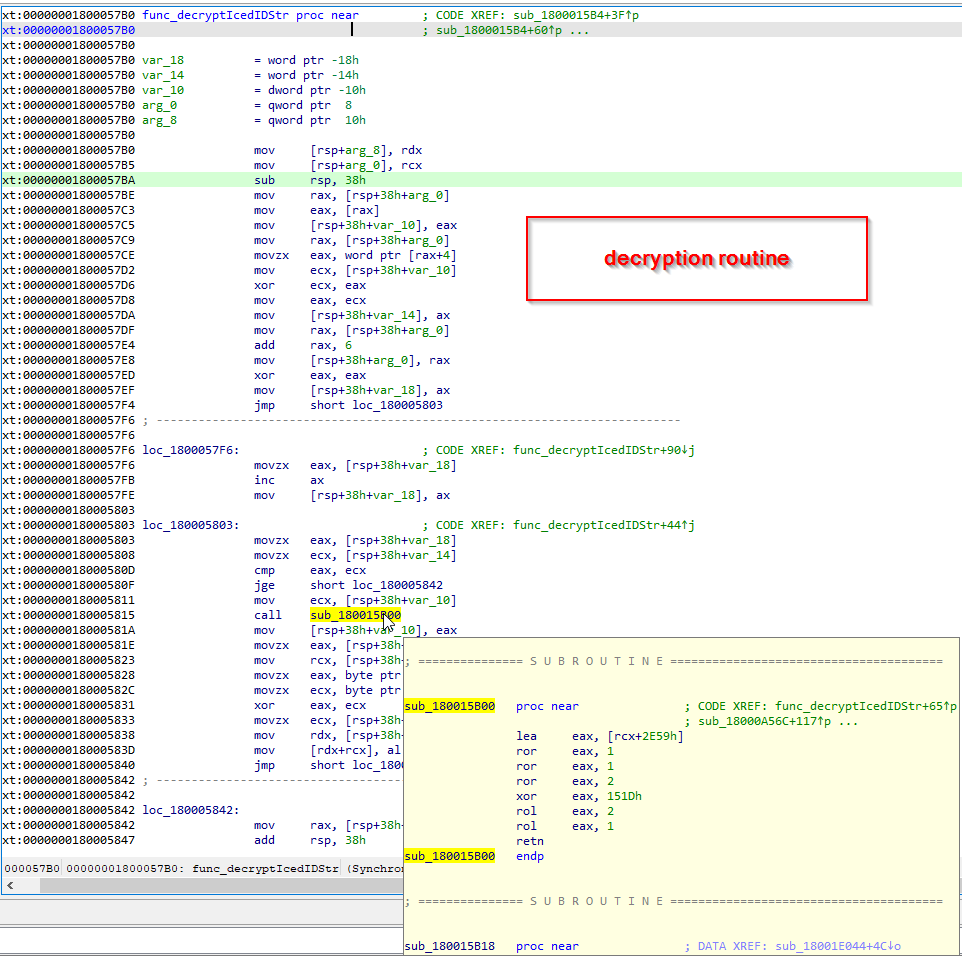
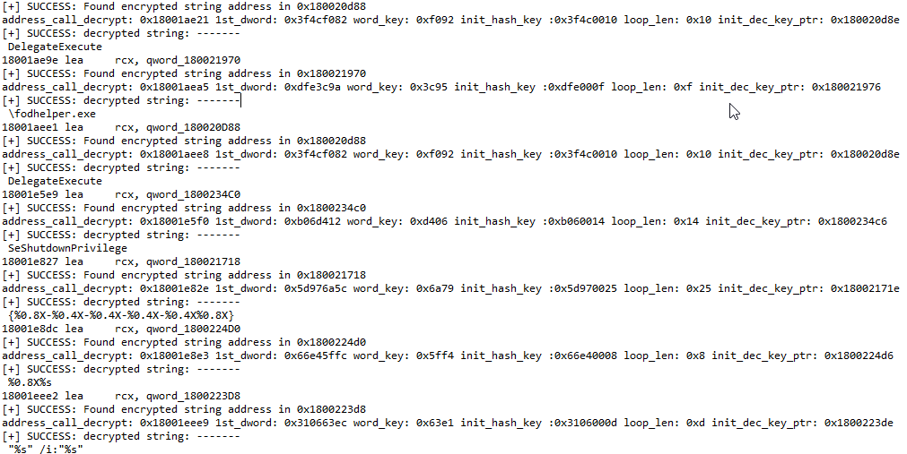
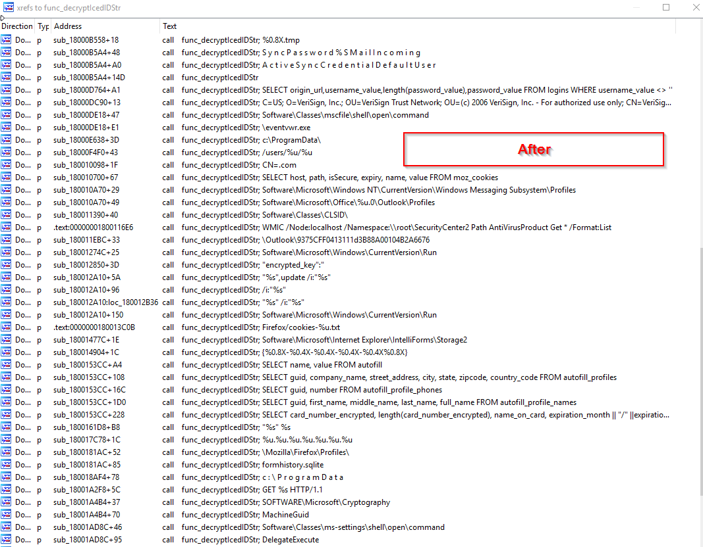

### Description
A simple IDA Python script to give some concept how to decrypt and annotate (comment) it in ida pro for better static analysis during malware reverse engineering.

### How:
1. just load this idapython in loaded exe in idapro (make sure you are in code section).
2. This is test in IDA python 7.5+

### Approach:
1. since this script is designed to simulate the decryption of icedid corebot to its strings, first you need to figure out which function is the decryption routine in my case I rename it as "func_decryptIcedIDStr"
2. once you know the decryption routine try to analyze it how it works and simulate it or use ida Appcall function(I'll try to create another version of this in using that featrure :))
3. then locate all code referenceing the decryption function to locate the needed parameter to decrypt the string. in this case it is "lea" and "mov" instruction
4. then let idapython help you :)

### screenshots

### view of all address xref the decryption routine

 </img>

### the decryption routine

 </img>

### some debug logs during the execution of script

 </img>

### after the execution of the script

 </img>
