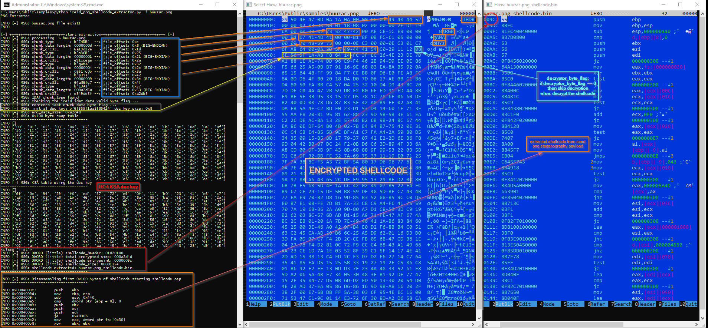
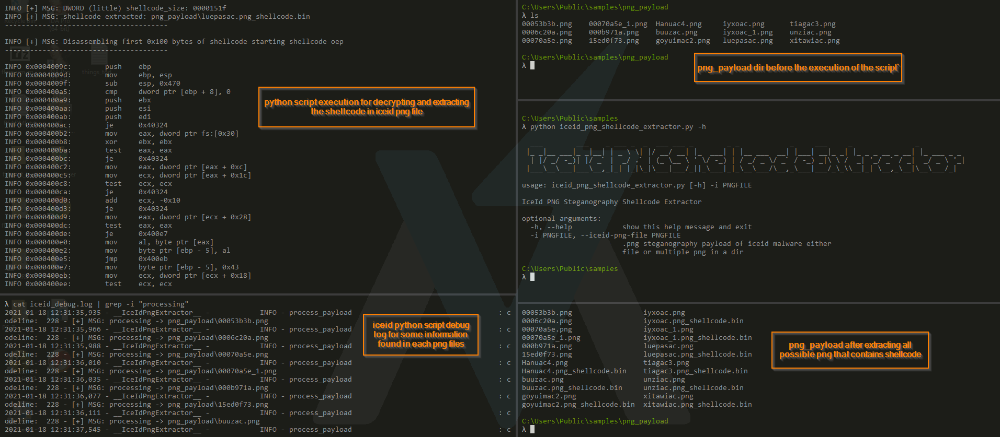

# ICEID PNG PAYLOAD SHELLCODE EXTRACTOR

### Description: 
this is a simple script to automatically extract the encrypted shellcode of iceid that are place in its PNG payload (steganography). 
This tool can accept a single png or multiple png files place in a dir to extract its shellcode.

### Why?
1. the iceid variant that supported by this tools has same png payload structure that can be parse within the png file itself including the rc4 decryption (8 bytes), encrypted data, size of encrypted data
2. to minimize the time to reversing all over again the decryptor module of iceid (with the same decryption algo)
3. the png file is downloaded and place in a random folder in %appdata% using the username of the infected machine. so to decrypt it manually you need to know the random folder name that this malware created to successfully decrypt it.


### script tool logs and comments.

 </img>

### sript tool extraction test.

 </img>


### debug logs

this also create a "iceid_debug.log" in current working folder that contain all the parse information did by this tool for further checking and verification.

# console log example.
```
λ python iceid_png_shellcode_extractor.py -i buuzac.png

  ___        ___    _ ___ _  _  ___ ___ _        _ _            _     ___     _               _
 |_ _|__ ___|_ _|__| | _ \ \| |/ __/ __| |_  ___| | |__ ___  __| |___| __|_ _| |_ _ _ __ _ __| |_ ___ _ _
  | |/ _/ -_)| |/ _` |  _/ .` | (_ \__ \ ' \/ -_) | / _/ _ \/ _` / -_) _|\ \ /  _| '_/ _` / _|  _/ _ \ '_|
 |___\__\___|___\__,_|_| |_|\_|\___|___/_||_\___|_|_\__\___/\__,_\___|___/_\_\\__|_| \__,_\__|\__\___/_|

INFO [+] MSG: buuzac.png file exist!
INFO

[-] +++++++++++++++++++++++++start extraction+++++++++++++++++++++++++++++ [-]
INFO [+] MSG: processing -> buuzac.png
INFO [+] MSG: chunk_type       : b'IHDR'  --> file_offset: 0xc
INFO [+] MSG: chunk_data_length: 0000000d --> file_offset: 0x8 (BIG-ENDIAN)
INFO [+] MSG: chunk_crc32L     : 6a19d12e --> file_offset: 0x1d
INFO [+] MSG: chunk_type       : b'sRGB'  --> file_offset: 0x25
INFO [+] MSG: chunk_data_length: 00000001 --> file_offset: 0x21 (BIG-ENDIAN)
INFO [+] MSG: chunk_crc32L     : e91cceae --> file_offset: 0x2a
INFO [+] MSG: chunk_type       : b'gAMA'  --> file_offset: 0x32
INFO [+] MSG: chunk_data_length: 00000004 --> file_offset: 0x2e (BIG-ENDIAN)
INFO [+] MSG: chunk_crc32L     : 0561fc0b --> file_offset: 0x3a
INFO [+] MSG: chunk_type       : b'pHYs'  --> file_offset: 0x42
INFO [+] MSG: chunk_data_length: 00000009 --> file_offset: 0x3e (BIG-ENDIAN)
INFO [+] MSG: chunk_crc32L     : 64a86fc7 --> file_offset: 0x4f
INFO [+] MSG: chunk_type       : b'IDAT'  --> file_offset: 0x57
INFO [+] MSG: chunk_data_length: 000a2d5a --> file_offset: 0x53 (BIG-ENDIAN)
INFO [+] MSG: chunk_crc32L     : e349de5f --> file_offset: 0xa2db5
INFO [+] MSG: IDAT chunk_type found
INFO [+] MSG: checking the iceid idat data valid byte flag....
INFO [+] MSG: non-zero idat chunk data byte flag ...
INFO [+] MSG: RC4 decryption key: b'6f565f1aa8f86414' dec_key_size: 0x8
INFO [+] MSG: enc_data_size: 0xa2d4d
INFO [+] MSG: RC4 0x100 byte swap table
---------------------------------------
INFO []
INFO ['00', '01', '02', '03', '04', '05', '06', '07', '08', '09', '0a', '0b', '0c', '0d', '0e', '0f']
INFO ['10', '11', '12', '13', '14', '15', '16', '17', '18', '19', '1a', '1b', '1c', '1d', '1e', '1f']
INFO ['20', '21', '22', '23', '24', '25', '26', '27', '28', '29', '2a', '2b', '2c', '2d', '2e', '2f']
INFO ['30', '31', '32', '33', '34', '35', '36', '37', '38', '39', '3a', '3b', '3c', '3d', '3e', '3f']
INFO ['40', '41', '42', '43', '44', '45', '46', '47', '48', '49', '4a', '4b', '4c', '4d', '4e', '4f']
INFO ['50', '51', '52', '53', '54', '55', '56', '57', '58', '59', '5a', '5b', '5c', '5d', '5e', '5f']
INFO ['60', '61', '62', '63', '64', '65', '66', '67', '68', '69', '6a', '6b', '6c', '6d', '6e', '6f']
INFO ['70', '71', '72', '73', '74', '75', '76', '77', '78', '79', '7a', '7b', '7c', '7d', '7e', '7f']
INFO ['80', '81', '82', '83', '84', '85', '86', '87', '88', '89', '8a', '8b', '8c', '8d', '8e', '8f']
INFO ['90', '91', '92', '93', '94', '95', '96', '97', '98', '99', '9a', '9b', '9c', '9d', '9e', '9f']
INFO ['a0', 'a1', 'a2', 'a3', 'a4', 'a5', 'a6', 'a7', 'a8', 'a9', 'aa', 'ab', 'ac', 'ad', 'ae', 'af']
INFO ['b0', 'b1', 'b2', 'b3', 'b4', 'b5', 'b6', 'b7', 'b8', 'b9', 'ba', 'bb', 'bc', 'bd', 'be', 'bf']
INFO ['c0', 'c1', 'c2', 'c3', 'c4', 'c5', 'c6', 'c7', 'c8', 'c9', 'ca', 'cb', 'cc', 'cd', 'ce', 'cf']
INFO ['d0', 'd1', 'd2', 'd3', 'd4', 'd5', 'd6', 'd7', 'd8', 'd9', 'da', 'db', 'dc', 'dd', 'de', 'df']
INFO ['e0', 'e1', 'e2', 'e3', 'e4', 'e5', 'e6', 'e7', 'e8', 'e9', 'ea', 'eb', 'ec', 'ed', 'ee', 'ef']
INFO [+] MSG: RC4 KSA table using the dec key
---------------------------------------
INFO []
INFO ['6f', '0e', '94', '29', 'f0', 'ed', '57', '72', 'e9', '0f', '11', 'b0', '23', '41', 'c6', 'c7']
INFO ['a3', 'f8', '08', 'a8', '1b', '46', '35', '5c', '9d', '8a', '85', 'ba', '65', '93', '71', '2a']
INFO ['d7', '37', 'cf', '19', '51', 'e0', '42', '80', 'eb', '97', '09', '20', '6d', '21', 'a1', '32']
INFO ['d1', '58', 'e6', '33', '47', 'a5', '0b', '4e', 'bc', '3b', 'e4', 'b8', '5e', '39', '2b', 'df']
INFO ['ee', 'fb', '53', '83', 'ef', '7a', '52', '70', 'fe', 'ce', 'b9', '82', '0d', '36', '5b', 'be']
INFO ['7d', '07', 'd5', 'dc', '05', '8b', '04', '10', 'ff', 'ae', '67', 'ea', '0c', '1c', '8d', 'a7']
INFO ['f9', '5d', 'fd', 'e7', '54', 'c9', '9b', '88', '2f', '69', '81', 'd0', '79', '84', 'b6', 'ca']
INFO ['c2', '12', 'd8', 'de', 'fa', '8c', '7c', '6e', '3d', 'bf', '56', '16', 'b2', '8e', 'cb', '4c']
INFO ['1d', '62', '49', '13', 'd4', '8f', 'f7', '92', '89', 'c5', '15', '1a', 'd3', '2d', 'bd', '73']
INFO ['6c', '50', '66', '01', '27', 'ac', '44', '59', '99', 'bb', '78', '7e', '76', 'f2', 'f4', '06']
INFO ['77', '26', '61', '5f', 'b5', 'b4', '4f', 'e1', 'c0', '98', '4d', '55', '14', '03', '96', 'ec']
INFO ['d6', '63', '68', '18', 'e2', '4a', 'b3', '64', '4b', '1e', 'c4', 'a4', '3a', 'f3', 'f5', 'c1']
INFO ['a0', '7f', '25', '9e', 'cd', '75', '24', '34', 'a9', '87', 'cc', '17', '31', '00', 'f6', 'db']
INFO ['5a', 'f1', 'a6', '0a', 'fc', '9a', '86', '60', 'c3', 'ad', 'da', '90', '30', '38', '91', '40']
INFO ['02', 'af', 'e8', '2e', '74', '1f', 'aa', '45', '3c', '7b', 'a2', 'd2', '43', '28', 'd9', 'e5']
INFO [+] MSG: DWORD (little) shellcode_header: 01020100
INFO [+] MSG: DWORD (little) total_encrypted_size: 000a2d4d
INFO [+] MSG: DWORD (little) shellcode_entrypoint: 0000009c
INFO [+] MSG: DWORD (little) shellcode_size: 00001354
INFO [+] MSG: shellcode extracted: buuzac.png_shellcode.bin
---------------------------------------

INFO [+] MSG: Disassembling first 0x100 bytes of shellcode starting shellcode oep
---------------------------------------

INFO 0x0004009c:        push    ebp
INFO 0x0004009d:        mov     ebp, esp
INFO 0x0004009f:        sub     esp, 0x440
INFO 0x000400a5:        cmp     dword ptr [ebp + 8], 0
INFO 0x000400a9:        push    ebx
INFO 0x000400aa:        push    esi
INFO 0x000400ab:        push    edi
INFO 0x000400ac:        je      0x40308
INFO 0x000400b2:        mov     eax, dword ptr fs:[0x30]
INFO 0x000400b8:        xor     ebx, ebx
INFO 0x000400ba:        test    eax, eax
INFO 0x000400bc:        je      0x40308
INFO 0x000400c2:        mov     eax, dword ptr [eax + 0xc]
INFO 0x000400c5:        mov     ecx, dword ptr [eax + 0x1c]
INFO 0x000400c8:        test    ecx, ecx
INFO 0x000400ca:        je      0x40308
INFO 0x000400d0:        add     ecx, -0x10
INFO 0x000400d3:        je      0x40308
INFO 0x000400d9:        mov     eax, dword ptr [ecx + 0x28]
INFO 0x000400dc:        test    eax, eax
INFO 0x000400de:        je      0x400e7
INFO 0x000400e0:        mov     al, byte ptr [eax]
INFO 0x000400e2:        mov     byte ptr [ebp - 9], al
INFO 0x000400e5:        jmp     0x400eb
INFO 0x000400e7:        mov     byte ptr [ebp - 9], 0x43
INFO 0x000400eb:        mov     ecx, dword ptr [ecx + 0x18]
INFO 0x000400ee:        test    ecx, ecx
INFO 0x000400f0:        je      0x40308
INFO 0x000400f6:        mov     eax, 0x5a4d
INFO 0x000400fb:        cmp     word ptr [ecx], ax
INFO 0x000400fe:        jne     0x40308
INFO 0x00040104:        mov     esi, dword ptr [ecx + 0x3c]
INFO 0x00040107:        add     esi, ecx
INFO 0x00040109:        cmp     esi, ecx
INFO 0x0004010b:        jb      0x40308
INFO 0x00040111:        lea     eax, [ecx + 0x1000]
INFO 0x00040117:        cmp     esi, eax
INFO 0x00040119:        jae     0x40308
INFO 0x0004011f:        cmp     dword ptr [esi], 0x4550
INFO 0x00040125:        jne     0x40308
INFO 0x0004012b:        mov     edi, dword ptr [esi + 0x78]
INFO 0x0004012e:        test    edi, edi
INFO 0x00040130:        je      0x40308
INFO 0x00040136:        lea     eax, [edi + ecx]
INFO 0x00040139:        cmp     eax, ecx
INFO 0x0004013b:        jb      0x40308
INFO 0x00040141:        mov     esi, dword ptr [esi + 0x50]
INFO 0x00040144:        lea     eax, [edi + ecx]
INFO 0x00040147:        add     esi, ecx
INFO 0x00040149:        cmp     eax, esi
INFO 0x0004014b:        jae     0x40308
INFO 0x00040151:        mov     edx, dword ptr [eax + 0x20]
INFO 0x00040154:        mov     edi, dword ptr [eax + 0x1c]
INFO 0x00040157:        add     edx, ecx
INFO 0x00040159:        mov     dword ptr [ebp - 0x1c], edx
INFO 0x0004015c:        add     edi, ecx
INFO 0x0004015e:        mov     edx, dword ptr [eax + 0x24]
INFO 0x00040161:        add     edx, ecx
INFO 0x00040163:        mov     dword ptr [ebp - 8], edx
INFO 0x00040166:        mov     edx, ebx
INFO 0x00040168:        cmp     edi, ecx
INFO 0x0004016a:        jb      0x40308
INFO 0x00040170:        cmp     edi, esi
INFO 0x00040172:        jae     0x40308
INFO 0x00040178:        cmp     dword ptr [ebp - 0x1c], ecx
INFO 0x0004017b:        jb      0x40308
INFO 0x00040181:        cmp     dword ptr [ebp - 0x1c], esi
INFO 0x00040184:        jae     0x40308
INFO 0x0004018a:        cmp     dword ptr [ebp - 8], ecx
INFO 0x0004018d:        jb      0x40308
INFO 0x00040193:        cmp     dword ptr [ebp - 8], esi
INFO 0x00040196:        jae     0x40308
INFO [-] +++++++++++++++++++++++++++++++++++++++++++++++++++++++++++++++++++++++++ [-]
```
