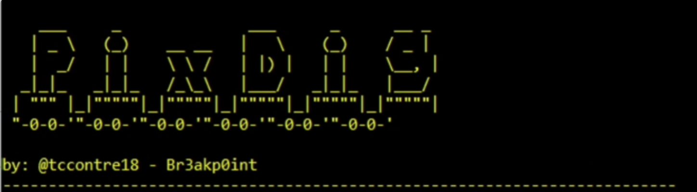

## Description

This is a simple tool designed to extract the hidden payload hidden in the image files (.bmp and .png) in resource metadata of this .NET Loader

## usage
powershell -file pixdig.ps1 -path <full file path or directory path of malware samples>

## Output Examples

### Extracted Payload in .BMP Image File:

### Extracted Payload in .PNG Image File:

### Dump Extracted Payload in Current Work Directory

