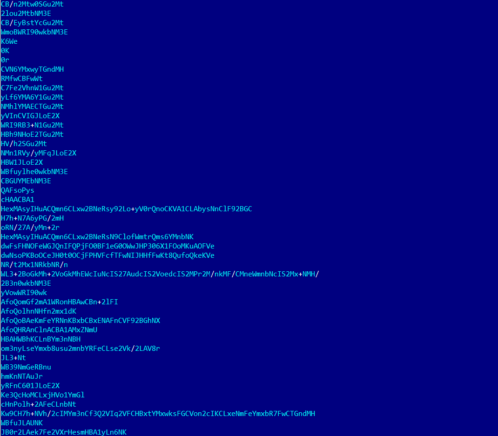
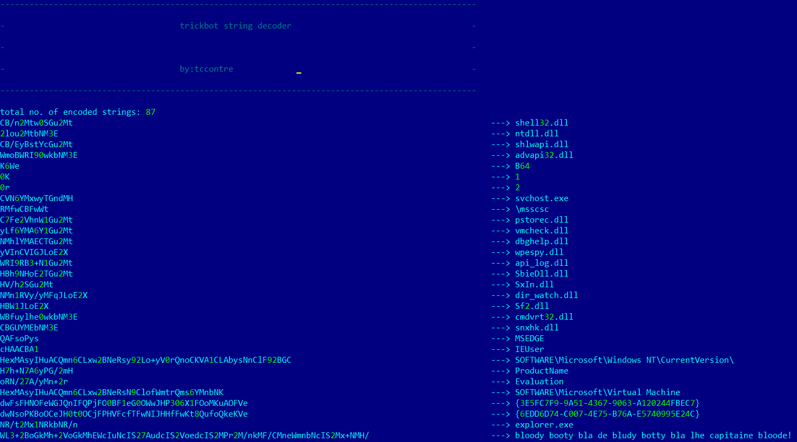

Description:
===========
This python script tool is a helper to decode all the tricbot string that has been encoded by a modified Base64 algorithm.

Steps:
======
<b>1. unpacked trickbot malware</b>
<b>2. extract the base64 dec_key phrase for input parameter.</b>
      
      <i> example: dec_key = "XITOPsM7khDJ0F85KocQHAmRWNY2Cydvr/S6unLlq9gZEjb+t31wefBVUGiz4xpa" </i>
      
<b>3. extract the encoded string and save it to a file like the format below. </b>

 </img>

<b>4. run the script with right parameter.</b>

```shell
usage: trickbot_dec.py [-h] -key CUSTOM_KEY -i INPUT_ENC

example:
trickbot_dec.py -key XITOPsM7khDJ0F85KocQHAmRWNY2Cydvr/S6unLlq9gZEjb+t31wefBVUGiz4xpa -i 3.txt > dec.txt
```

<b>5. then the output will look like this.</b>

 </img>

enjoy!!!
