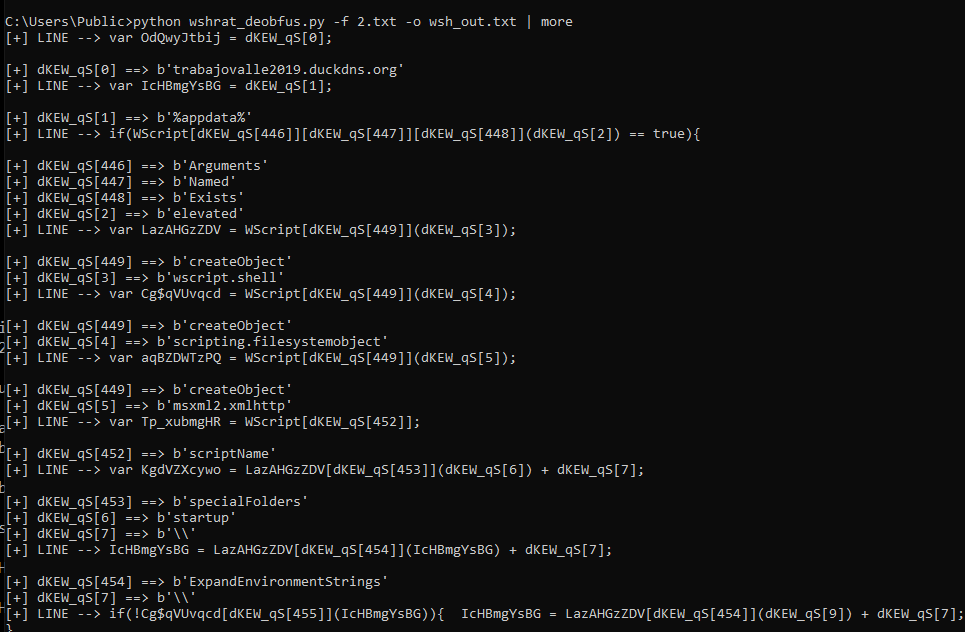

## Description:
Simple Python Script to learn how to de-obfuscate WSHRAT script to make it more easy to read and analyze statically.

## Technique
The Obfuscation technique is array indexing where it has a big chunk of hex encoded string that was reference in its code to initialize, process or execute.
in this manner it is not so easy to understand or read the code without normalizing the string in the array

The Idea is :
1. read each line of the wshrat script malware and check if there is a array referencing the  "dKEW_qS[]"
2. if yes grab the index number, locate the hex encoded string and then normalized it
3. copy that line into the output file as we as create a comment below the original code line 
4. if not just copy the original line

## usage 

 </img>

## Console Output of the python Script

 </img>

## File Generated by the Script 

# .net binary module encoded in base-64 
 </img>

 </img>

 </img>

# Before

 </img>

# After
 </img>

## Samples

https://bazaar.abuse.ch/sample/a183659739697afae7abb37a3946c1ffdb66500c5ae3bc9b874c7f2e6ab7d753/
https://bazaar.abuse.ch/sample/5e97f6fda0b360ee80bbf174a7fd063a3916c577d3e98d4b05024ef3dd304c51/
